# Practica01---Mi-Blog
Practicando HTML5 Por Angel Ruiz

1.	Creación de un repositorio:
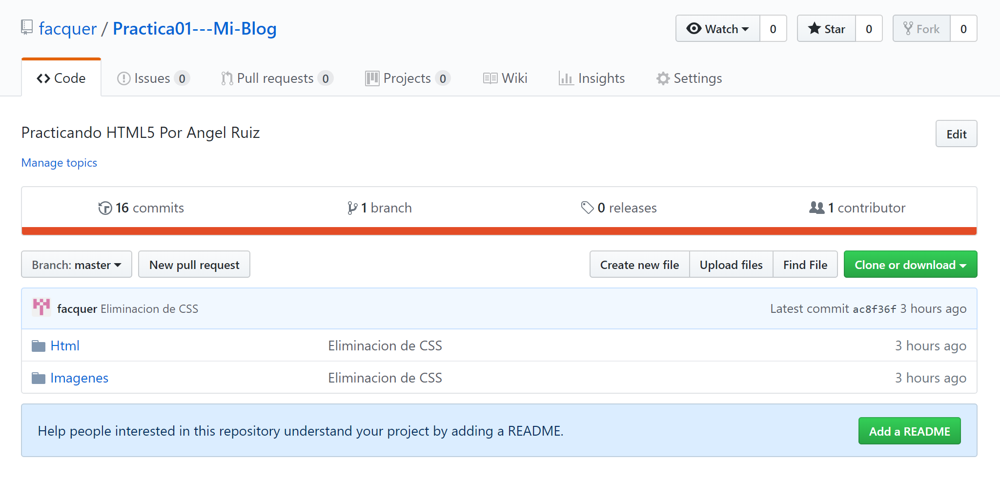

Nombre de usuario: Facquer

Enlace del repositorio de la practica: https://github.com/facquer/Practica01---Mi-Blog

Enlace repositorio tutorial Thai: https://github.com/facquer/tutorialThai

2.	Commits y push
Para realizar los commits y push, se necesita instalar git en el pc y de ahí inicializar el repositorio desde visual studio.

Comandos para push y commits:
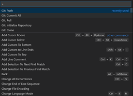

Commits realizados:
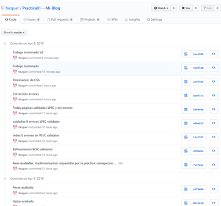

3.	W3C Validator

Para validar las paginas ingresamos en el siguiente enlance: https://validator.w3.org/

Capturas de la validacion:
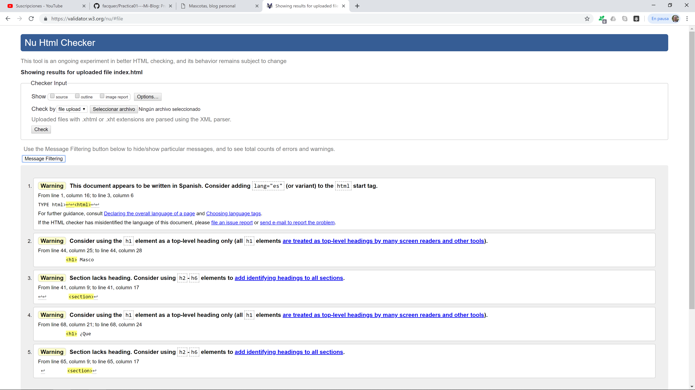
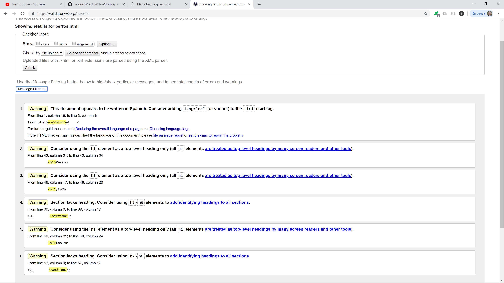
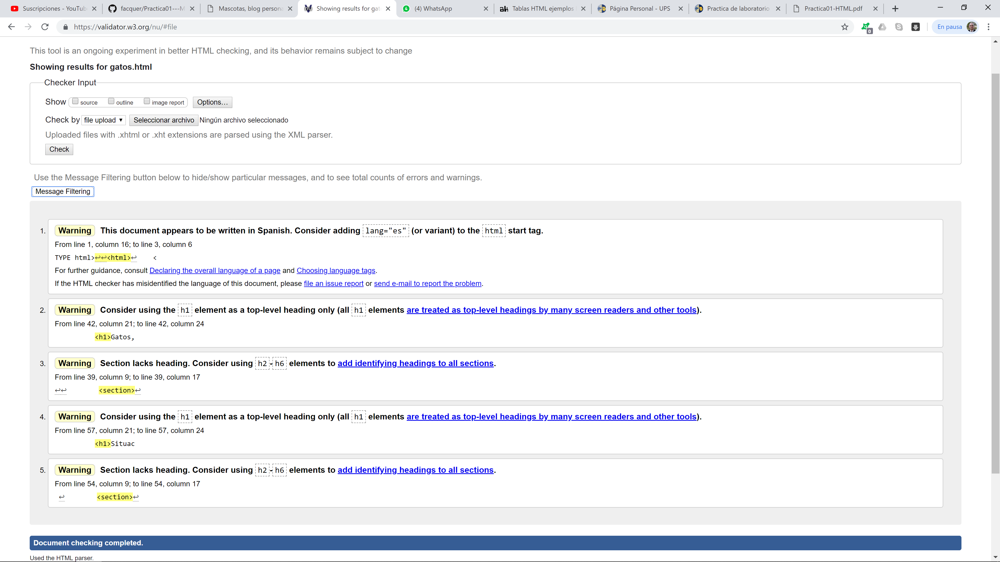
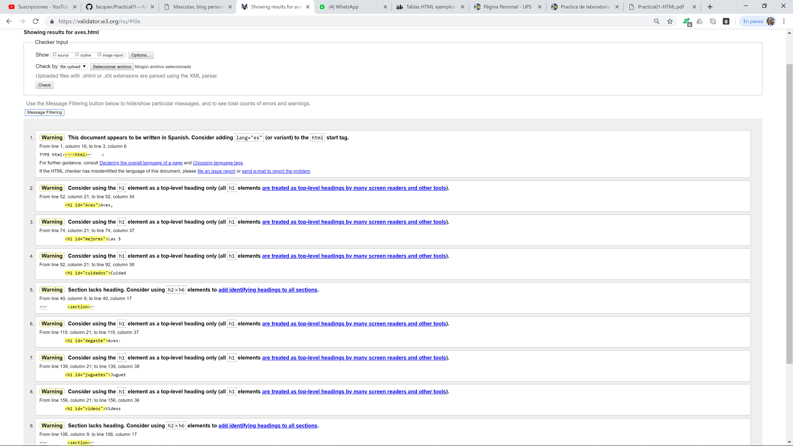
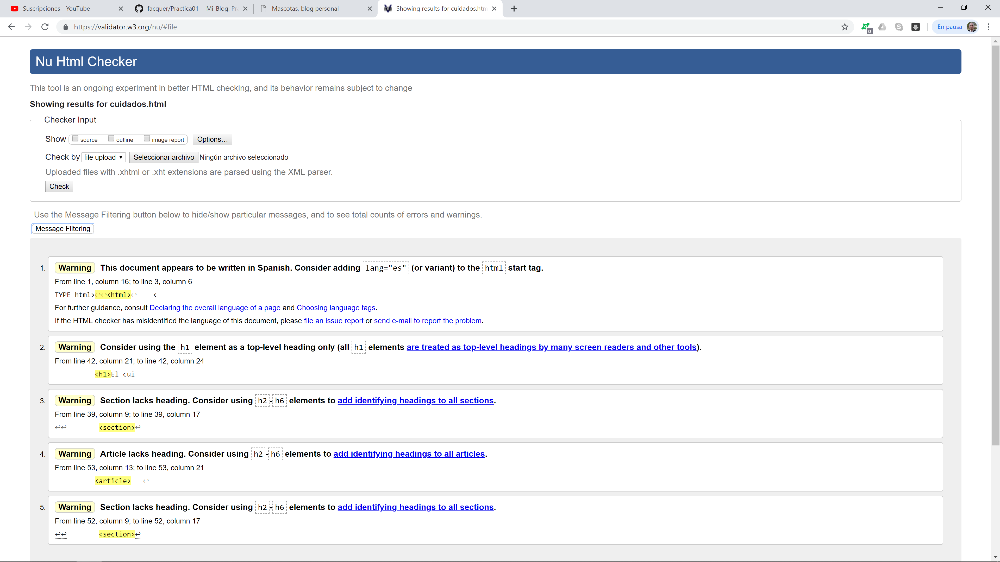
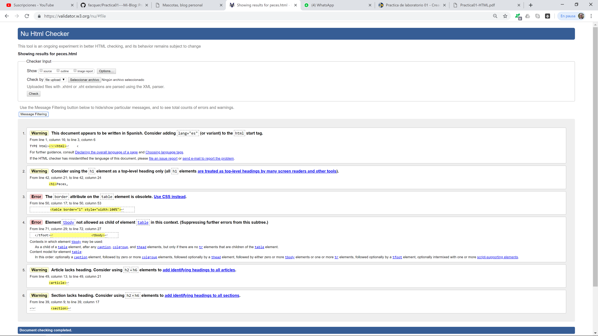

4.	Archivo README

Para crear el archivo nos vamos al repositorio y clickeamos a: ADD A README. Y comenzamos a editar como gustemos.
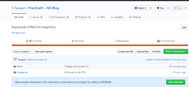

5.	Resultados

Estructura de mis paginas HTML:

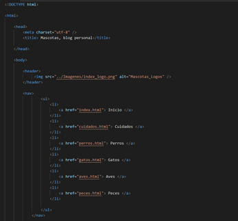
Todas las paginas cuentan con un <head> que contiene el título, además en el <body> todas tienes un <header> que contiene el logo de la página como la barra de navegación.
  
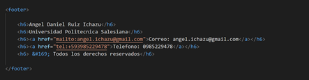
Además, todas la paginas cuentan con un <footer> para identificar el auto, en este caso soy yo.

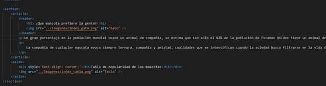
La estructura general de mis paginas HTML, manejan un formato similar a este, en algunas varia un poco pero es el mismo formato, uno o dos <section> que contiene uno o dos <article> y uno o dos <aside>, además cada artículo cuenta con su <header> correspondiente.
 
Etiquetas utilizadas para resolver los problemas planteados.

Para insertar vides de youtube se utiliza la siguiente línea:
<iframe width="560" height="315" src="EnlanceDeYoutubeAqui" allow="accelerometer; autoplay; encrypted-media; gyroscope; picture-in-picture" allowfullscreen></iframe>
Donde a dicha etiqueta se le dan atributo como el tamaño y lo que deseas permitirle hacer.

Para una lista ordenada utilice las siguientes etiquetas:
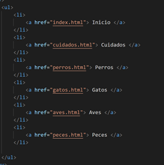

Para poder navegar en una misma pagina por secciones utilice ID:
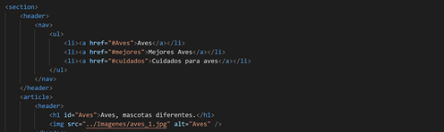

Para la creación de la tabla use las siguientes etiquetas:
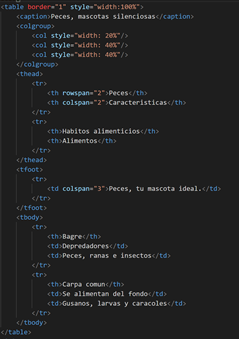

Y por último utilice diferentes etiquetas para darle estilo a mi página:
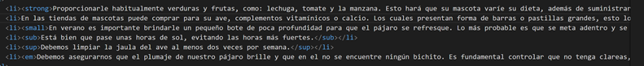

6.	Conclusiones
•	Realizando la práctica, se presentaron muchos problemas a la hora de tener un orden en las páginas, pero con el uso adecuado del formato se puede lograr entender fácilmente.
•	Al validar las paginas me percaté que el W3C validator lanza error a la hora de usar atributos como Border ya que actualmente está obsoleto e investigando pude observar que se usa CSS para ello.
•	Youtube permite código fuente para la incorporación de sus videos en la paginas HTML ahorrándonos tiempo.
•	Usando simplemente HTML se consigue una página bien estructurada pero muy poco atractiva por eso es necesario la incorporación de CSS

Docente: Ing. Gabriel León Paredes, PhD.
Firma: 

Estudiante: Angel Daniel Ruiz Ichazu
Firma: 

